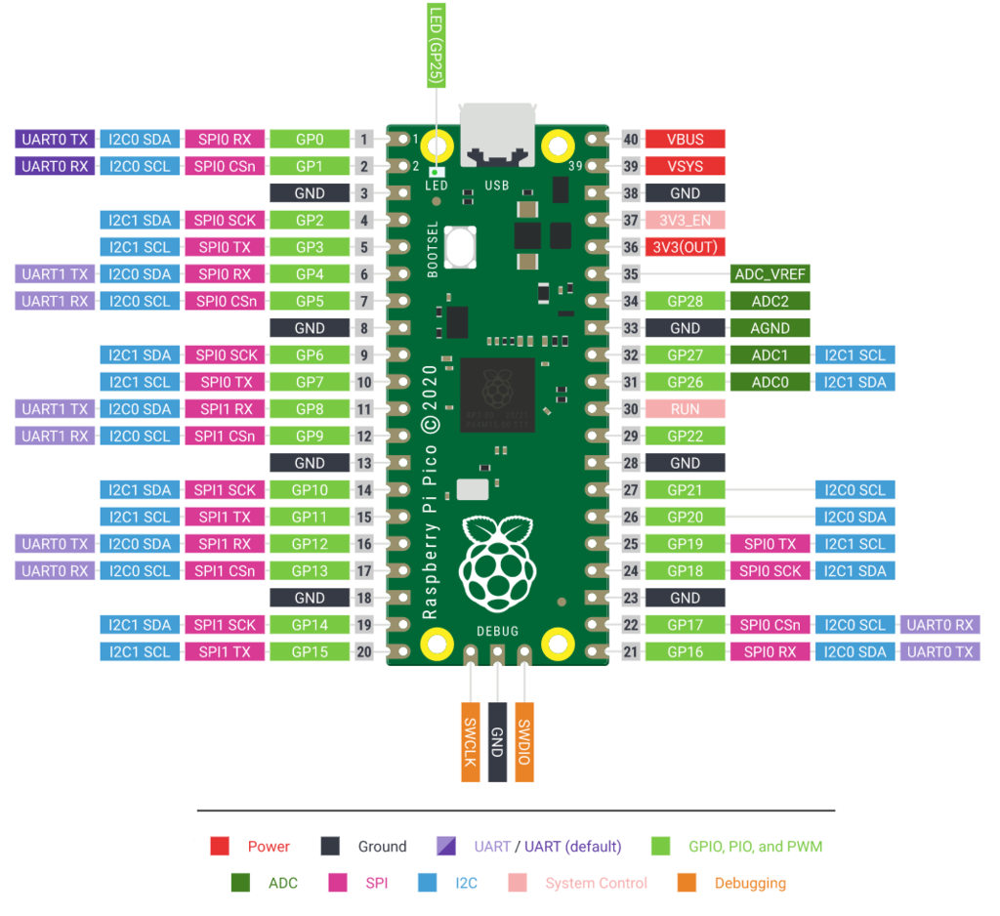
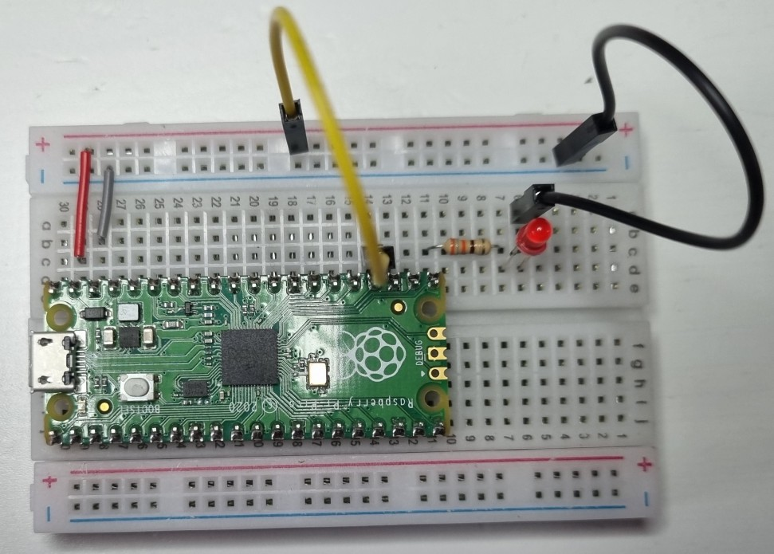
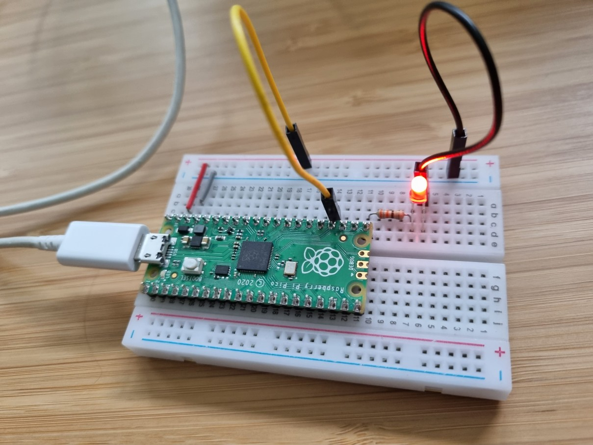
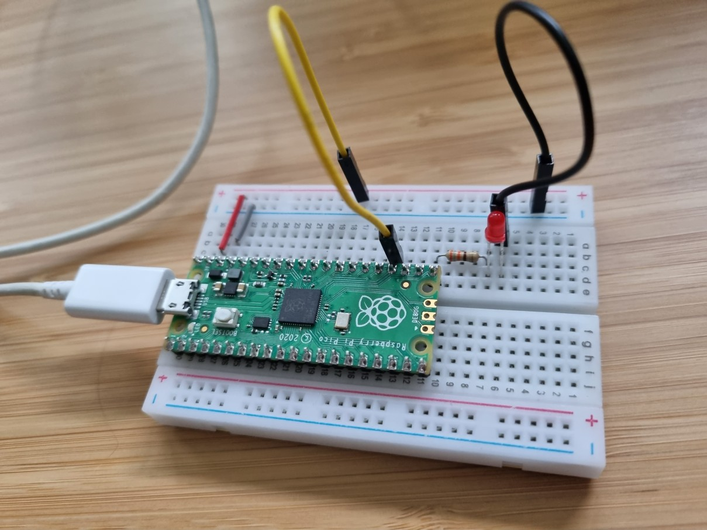

# Week 2

I added the [pico w go](https://marketplace.visualstudio.com/items?itemName=paulober.pico-w-go) extension to vscode. This allows me to upload my code to the pico running micropython firmware.

I read the information on [this website](https://www.hackster.io/shilleh/how-to-use-vscode-with-raspberry-pi-pico-w-and-micropython-de88d6) showing me how to configure my GPIO pins.

When i was creating my circuit i needed to know what GPIO pins i could use so i used this diagram.

I selected GPIO16 as my output to control the LED and GPIO18 as my input.

I created two files in this directory.  One that flashes the LED on and off automatically, showing that the GPIO output pin and circuit was working properly.

The second program controlled the LED by reading the state of the GPIO input pin.