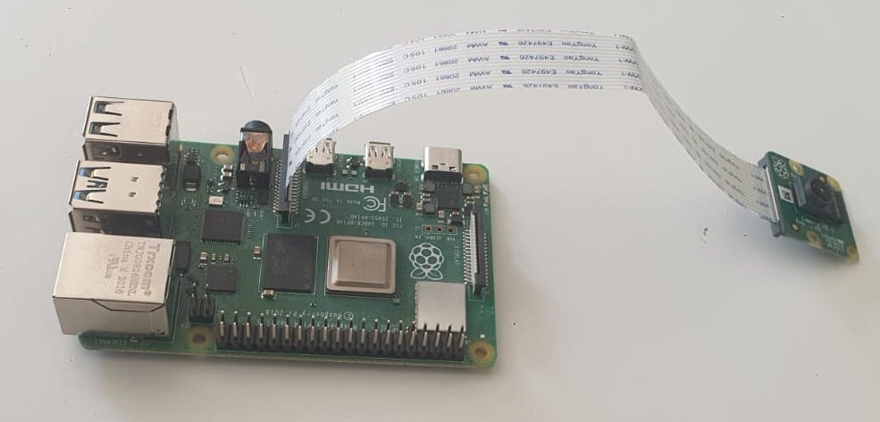
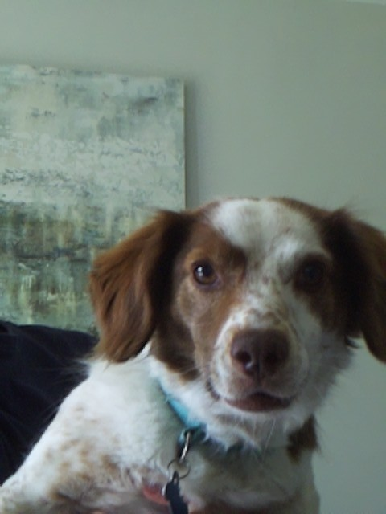

# Week 6

This week i am going to move to using a raspberry pi 4, the plan is to use a camera on the pi to and machine learnin got detect when a human is seen and when a dog is seen. 

The steps i will take is
- install raspbain onto the rapsberry pi
- add the camera
- install python
- write scripts to take picture

Next week i will explore using yolo object recognition using python to detect the difference between a person and a dog so i can see if there is someone at the door.

## Install raspbian
I used the [raspberry pi imager](https://www.raspberrypi.com/software/) to install the 64 bit rapberry pi OS onto the micro SD card. We preconfigured the following things
- the host name (picamera)
- the SSH with my public key
- username and passsword
- the Wifi

## Add the camera
I followed the instructions [here](https://www.raspberrypi.com/documentation/accessories/camera.html#libcamera-and-libcamera-apps) to add a camera module to the camera module port on the raspberry pi 4.

## Install python
Python came already installed

## Write scripts to take picture 
I wrote the code in pycamera.py to take a picture when the a button is pressed. This is the picture i took.
