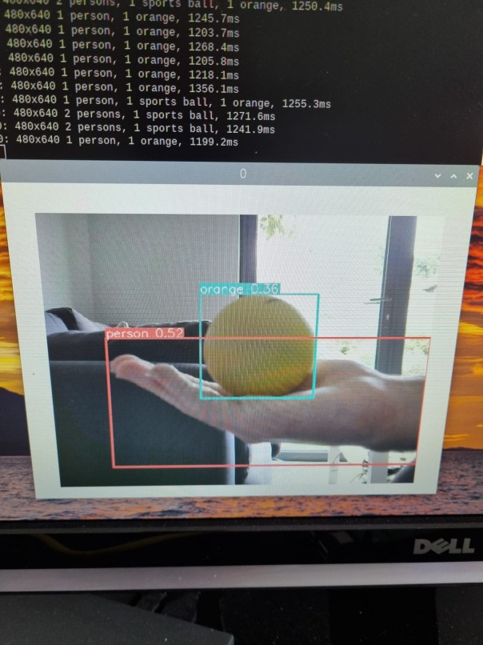

# Week 7

I watched [this video](https://www.youtube.com/watch?v=RsuJzsYuR-s) to give me details on how to install and use YOLO on the Raspberry Pi 4.

I installed the YOLO package with the command

```
pip3 install ultralytics
```

And then created the test file ```test.py``` that is in this folder.

The results can be seen in this image



You can see that it detected my arm as being part of a person, but incorrectly suggests that the stress ball is an orange.  This is understandable as the colour and shape could be interpreted as an orange.