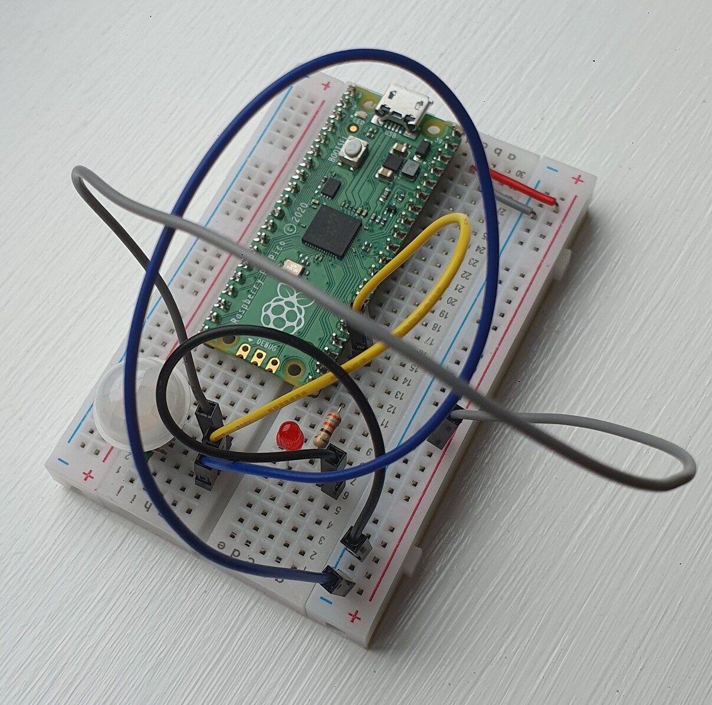

# Week 3

I added a passive infrared sensor ([PIR](https://en.wikipedia.org/wiki/Passive_infrared_sensor)) to the circuit so it could detect motion through changes in infrared radiation. Specifically I used [this](https://www.aliexpress.com/item/1005002563718380.html) PIR. 
The PIR has 3 connections: 
- voltage in (VIN)
- output (OUT)
- ground (GND)
I connected the VIN to the 3.3V, the OUT to GPIO18 and the GND to ground.

The code was identical to the code I used last week because it used GPIO18 for the input and the LED was attatched to GPIO16.
When motion was detected by the PIR, the LED switched on. The LED stayed on for 2 seconds because the PIR asserted the output for 2 seconds as outlined in the [specification](https://www.amazon.co.uk/Detector-HC-SR312-Pyroelectric-Infrared-Automatic/dp/B07XLKTQMG/ref=sr_1_5?crid=1DWXDZIJYY0HZ&keywords=pir+sensor+component&qid=1683986824&sprefix=pir+sensor+component%2Caps%2C117&sr=8-5)