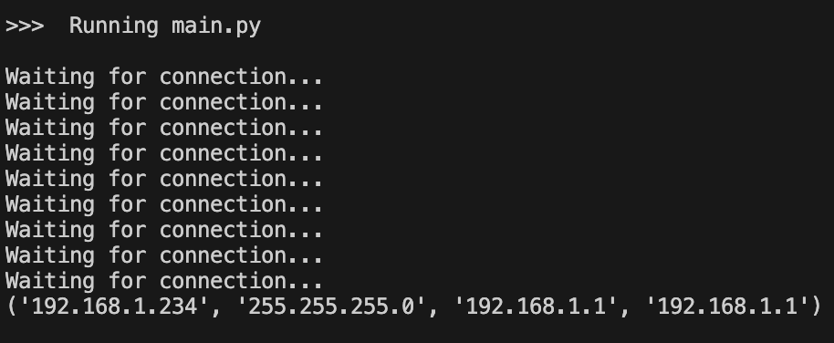

# Week 4

I downloaded the firmware for micropython and installed it on the pico w following the instructions on week 1. I could check that it was working by opening a screen command to open a terminal on the pico w.

I looked at the example of how to connect the pico w to the internet on [this](hhttps://projects.raspberrypi.org/en/projects/get-started-pico-w/2) website. 

When I run the code, I see this output 